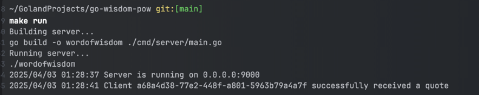
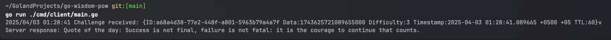

# Word of Wisdom TCP Server 

A TCP server protected from DDoS attacks using a Proof-of-Work (PoW) challenge-response protocol. After solving the challenge, the client receives a random "word of wisdom" quote.

---

## Task Scope and Expectations

- Implement a TCP server protected by a PoW challenge.
- Provide a client that solves the PoW and receives a quote.
- Use Docker for both server and client.
- Include configuration management and clean architecture.

---

## Functional Requirements

- **Server:**
  - Sends a PoW challenge with random data, timestamp, difficulty, and TTL.
  - Validates the client's solution and rejects expired challenges.
  - Sends a random quote on success.

- **Client:**
  - Connects to the server and receives the challenge.
  - Computes a nonce that satisfies the PoW condition.
  - Sends the solution and receives the quote.
  - Retries connection on failure.

---

## Technical Requirements

- **Language:** Go
- **PoW Algorithm:** SHA-256 based, configurable difficulty.
- **Configuration:** Managed via Viper using `config.yaml`.
- **Logging:** Standard `log` package.
- **Tests:** Unit tests for PoW module.
- **Concurrency:** Each client handled in a separate goroutine.
- **Security:** TTL check prevents replay attacks.

---

## Proof-of-Work Algorithm Explanation

The PoW algorithm is based on SHA-256. The client must find a nonce such that:

```
SHA256(challenge_data + nonce) starts with N leading zeros
```

**Why SHA-256:**
- Secure and widely adopted.
- Easy to implement and verify.
- CPU-bound: makes DDoS costly for attackers.
- Configurable difficulty.

---

## How to Run

### Build & Run (Locally)

```bash
make build          # Builds both server and client
make run            # Runs the server locally
make test           # Runs unit tests
make lint           # Runs code vetting
```

In a separate terminal:

```bash
go run ./cmd/client/main.go   # Or use: make build-client && ./wordofwisdom-client
```

### Using Docker Compose

```bash
make dc             # Runs both client and server via Docker Compose
```

---

## Additional Notes

- Quotes are stored locally in a simple slice (`internal/quotes/quotes.go`).
- PoW logic is modular and tested (`internal/pow`).
- All settings are configurable via `config/config.yaml`.
- The project avoids hardcoded values, unused dependencies, and logging inconsistencies.
- Clean and minimal Dockerfiles for both server and client are included.

## how to check locally
- make build
- make run
- go run ./cmd/client/main.go
- make run
- go run ./cmd/client/main.go 

## Demonstration 

**Server:**


**Client:**



